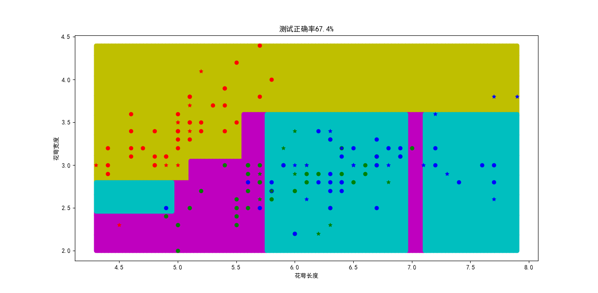
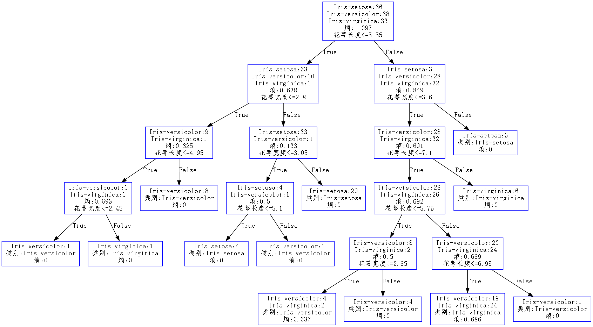
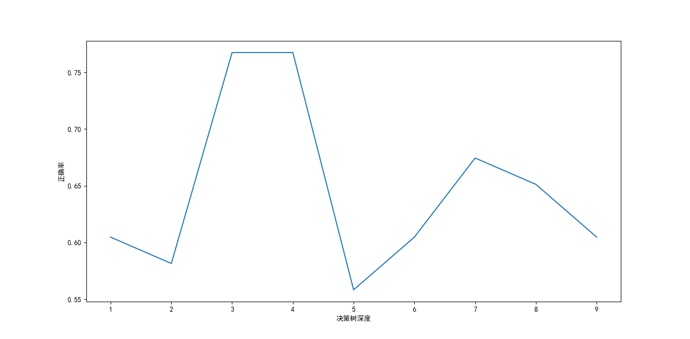
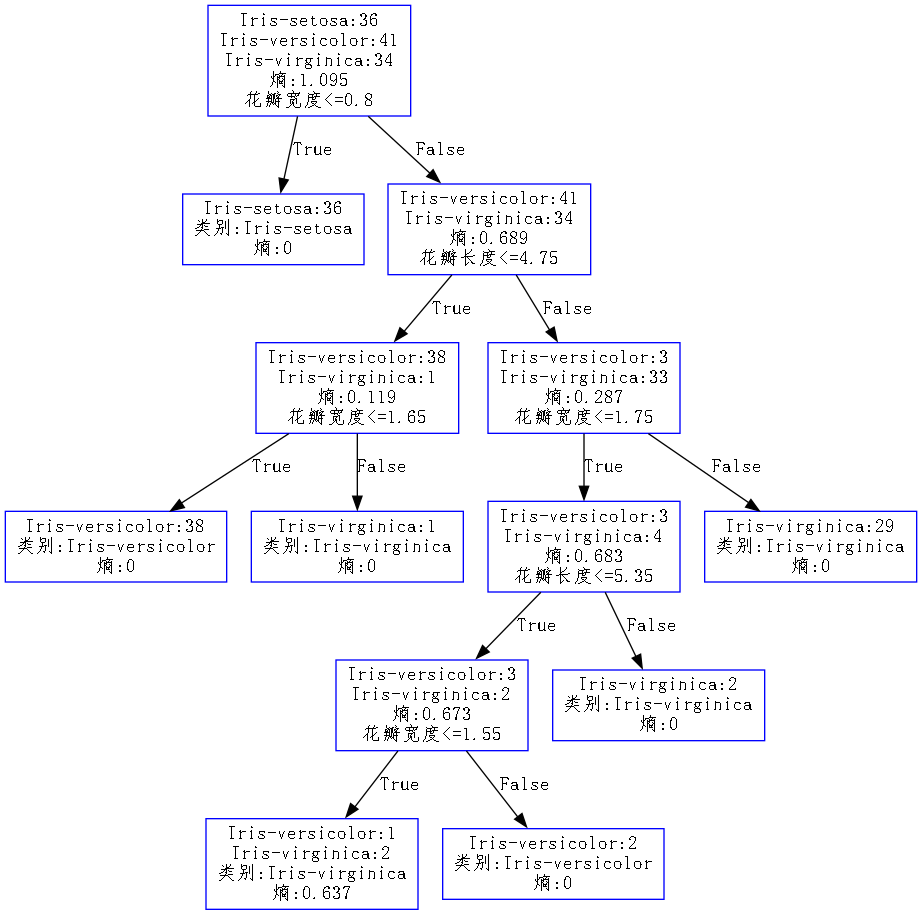
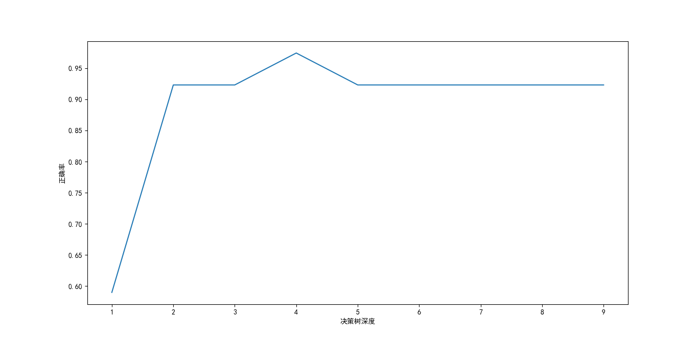
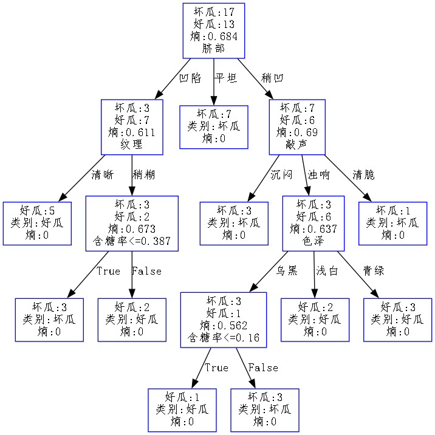
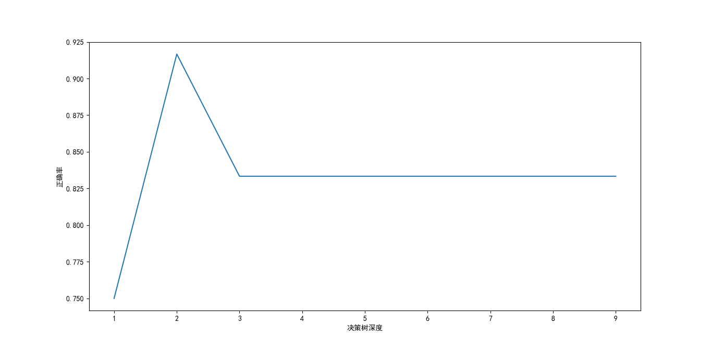

# 一、概述
基于Python.Numpy实现决策树，预测鸢尾花的种类与西瓜的好坏

# 二、文件夹结构功能
### 1.文件夹
- figure：该文档中的图片
- data：鸢尾花与西瓜数据集
- dot：dot文件路径
### 2.文件
- tree.py：树节点类
- decisiontree.py：决策树
- iris_test1.py：鸢尾花分类，测试离散属性分类，使用两个特征进行分类，绘制分类图
- iris_test2.py：鸢尾花分类，测试离散属性分类，使用四个特征进行分类，绘制决策树
- watermelon_test.py：西瓜分类，测试连续属性分类，绘制决策树

# 三、项目运行
## 1.决策树分类结果演示
### 1.1测试目标
- 使用二维特征对鸢尾花进行分类
- 绘制决策树在平面内分类界限
- 绘制决策树
- 观察决策树深度对预测正确率的影响
### 1.2测试方式
- 运行iris_test1.py文件
### 1.3测试结果
- 1.绘制决策树在平面内分类界限如下图所示，其中圆点为训练数据集，星点为测试数据集。测试数据集预测正确率为67.4%。

- 2.决策树如下图所示。

- 3.决策树深度对预测正确率的影响如下图所示，可以观察到，决策树的预测正确率并不随着深度的加深而增加。

## 2.鸢尾花决策树分类结果演示
### 2.1测试目标
- 使用所有特征对鸢尾花进行分类
- 绘制决策树
- 观察决策树深度对预测正确率的影响
### 2.2测试方式
- 运行iris_test2.py文件
### 2.3测试结果
- 1.决策树如下图所示。

- 2.决策树深度对预测正确率的影响如下图所示。

## 3.西瓜决策树分类结果演示
### 3.1测试目标
- 使用所有特征对西瓜进行分类
- 测试连续、离散属性混合分类
- 绘制决策树
- 观察决策树深度对预测正确率的影响
### 3.2测试方式
- 运行watermelon_test.py文件
### 3.3测试结果
- 1.决策树如下图所示。

- 2.决策树深度对预测正确率的影响如下图所示。

# 四、说明
绘制决策树需要使用graphviz工具。
运行该工程只需安装graphviz即可，不需要安装graphviz的python包。

[graphviz使用教程](https://itopic.org/graphviz.html)